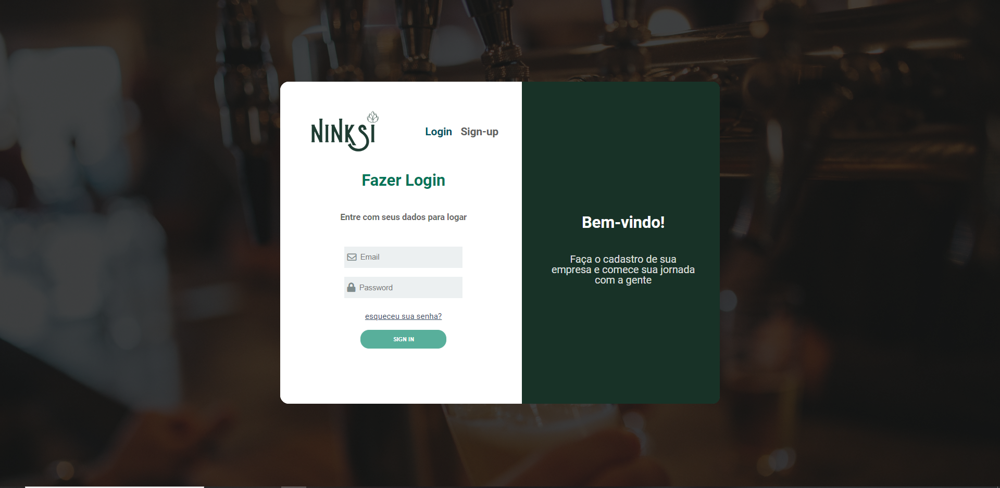

<h1 align ="center">
    </img>
</h1>

 
## Ninkasi 🚀 em construção... 🚧

## 💻 Sobre o projeto

> O projeto Ninkasi almeja ser o novo canal de relacionamento interativo entre a AMBEV e seus revendedores.
> Facilitando a aquisição de produtos por parte dos associados e suportando o processo de venda por meio de:

- Plataforma inovadora de comunicação focada na experiência do usuário
- Intermédio do processo de vendas por meio de integrações bancárias
- Palanque para novas estratégias de marketing adotadas pela Ambev

## 🛠 Tecnologias

Front End

- HTML
- CSS
- JavaScript

Back End

- Nodejs
- Express
- MySQL
- Bcrypt

## 💡 Curiosidades

> Como prova de conceito, a plataforma foi construída utilizando apenas as tecnologias base da web.
> Desta forma, sendo molde para implementação dentro dos padrões e tecnologias adotadas pela Ambev.

## 🎨 Layout
> O [layout](https://www.figma.com/file/eWYNAJKv9wt8FiOhHTB5xV/Mega-Hack-Project?node-id=0%3A1) da aplicação está disponível no Figma:

## :hammer: Hospedagem
> [Heroku](https://ninkasisum.herokuapp.com/)

## 🤖 Equipe
- [Bianca](https://github.com/bkkater)
- [Isaddora](https://www.linkedin.com/in/isadorafreitas)
- [Olívia](https://www.linkedin.com/in/oliviaboretti/)
- [Jenniffer](https://www.linkedin.com/in/jenniaol/)
- [Dayana](https://www.linkedin.com/in/dayana-miranda-217a02166/)

## 📏 Mentores
- [Igor](https://www.linkedin.com/in/igor-arnaldo-de-alencar-5219b014b/)
- [Alan](https://www.linkedin.com/in/alan-almeida/)

